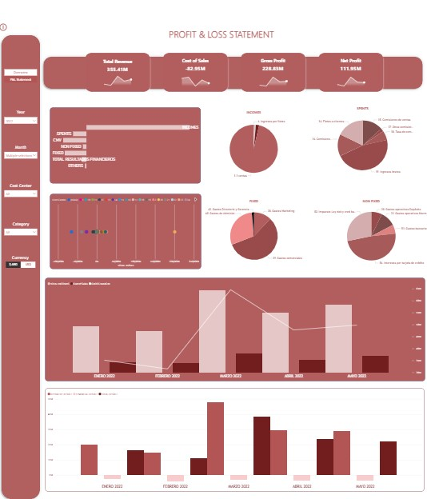
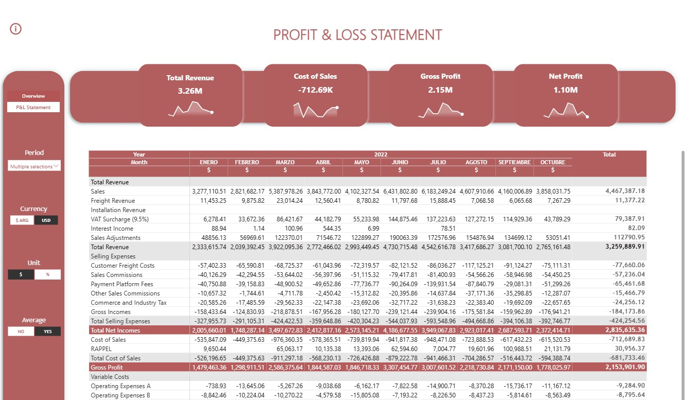

# Dynamic P&L Statement

Interactive **P&L Statement** built in **Power BI** with dynamic financial logic, including **gross vs net analysis**, **ARS/USD currency switching**, **$ / % views**, and **total vs average periods**. Designed with reusable **DAX measures**, secure data handling, and a focus on accurate **financial analysis** and business decision-making.

## Context
A construction company required a flexible P&L dashboard to analyze financial performance across different periods, currencies, and aggregation levels. The solution needed to support management analysis while maintaining strong control over data accuracy and integrity.

## Objectives
- Build a dynamic **P&L Statement**
- Enable **vertical** and **horizontal analysis**
- Allow switching between **ARS / USD**
- Allow switching between **$ / %**
- Allow **Total vs Average** of selected months
- Ensure **data integrity** (no manual modification)

## Technical Stack

**Power BI**
- Data modelling (star schema design)
- Measure-driven reporting architecture
- KPI card design and financial dashboards
- Dynamic slicer-controlled reports

**DAX**
- Context manipulation using CALCULATE
- Conditional logic with SWITCH(TRUE())
- Dynamic selection using SELECTEDVALUE
- Reusable financial measure structure

**Power Query (M)**
- Data cleaning and normalization
- Column transformations and data shaping
- Merging and appending queries
- Handling duplicate records
- Preparing structured financial datasets

**SQL (Firebird – IBExpert)**
- Custom view creation
- Aggregation and grouping logic
- Join operations across financial tables
- Preventing duplication in expense merging
- Structured extraction for BI reporting

**Financial Reporting Expertise**
- Vertical and horizontal P&L analysis
- Contribution margin structure
- Multi-currency financial reporting
- Dynamic gross vs net revenue logic

## Notes on Data
For confidentiality reasons, the PBIX file and original client data are not shared publicly.
All numeric values shown in the screenshots were modified and anonymized, and in some cases no longer reflect real business meaning, in order to fully protect sensitive financial information. The focus of this project is on modeling logic, interactivity, and analytical design, rather than on the specific figures.

## Screenshots

### P&L Overview

### Financial Analysis
 

### Dynamic Logic (Currency, Units, Averages)

### Dynamic Logic (Currency, Units, Averages)

