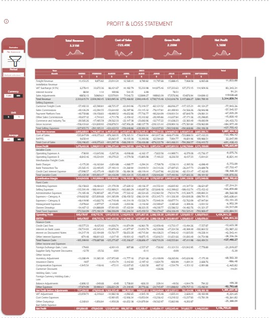

# Dynamic P&L Statement – SQL - Power BI

Interactive **P&L Statement** built in **Power BI** with dynamic financial logic, including **gross vs net analysis**, **ARS/USD currency switching**, **$ / % views**, and **total vs average periods**. Designed with reusable **DAX measures**, secure data handling, and a focus on accurate **financial analysis** and business decision-making.

## Context
A construction company required a flexible P&L dashboard to analyze financial performance across different periods, currencies, and aggregation levels. The solution needed to support management analysis while maintaining strong control over data accuracy and integrity.

## Objectives
- Build a dynamic **P&L Statement**
- Enable **vertical** and **horizontal analysis**
- Allow switching between **ARS / USD**
- Allow switching between **$ / %**
- Allow **Total vs Average** of selected months
- Ensure **data integrity** (no manual modification)

## Tools
- **Power BI**
- **DAX**
- **Power Query**
- **SQL (Firebird via IBExpert)**

## Key Features
- Reusable **DAX** logic using **CALCULATE**, **SWITCH(TRUE())**, and **SELECTEDVALUE**
- Dynamic percentages based on **gross** or **net sales**
- Correct average calculations using **DISTINCTCOUNT**
- Fully interactive report controlled by **slicers**

## Notes on Data
For confidentiality reasons, the PBIX file and original client data are not shared publicly.
All numeric values shown in the screenshots were modified and anonymized, and in some cases no longer reflect real business meaning, in order to fully protect sensitive financial information. The focus of this project is on modeling logic, interactivity, and analytical design, rather than on the specific figures.

## Screenshots

### P&L Overview

### Financial Analysis

### Dynamic Logic (Currency, Units, Averages)

### Dynamic Logic (Currency, Units, Averages)

